# REPLICA DE BASES DE DATOS GRUPO N°6

A continuación se documenta el proceso completo de configuración de la replicación transaccional utilizando SQL Server Developer como publicador y servidores remotos unidos mediante Hamachi como suscriptores. Todas las imágenes se encuentran en la carpeta `imagenes_rp/` en la raíz del proyecto.

---

## 1. Base de datos lista para replicar

### La base estaba lista con todas sus tablas preparadas para ser publicadas.

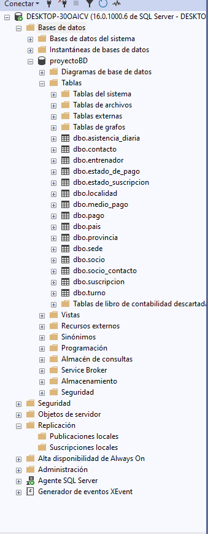

## 1.1. Carpeta del snapshot generada

### Snapshot listo para distribución.

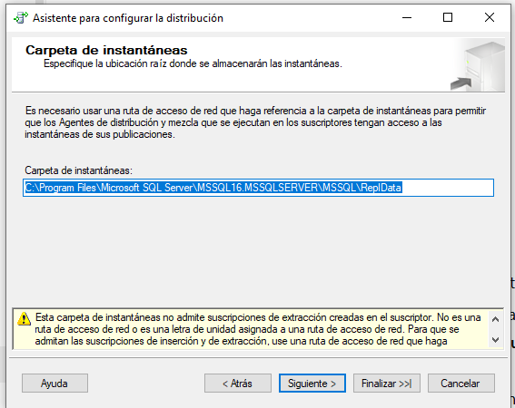

---

## 1.2 Base distribuidora

### La base distribuidora queda configurada para manejar los snapshots y enviar cambios.

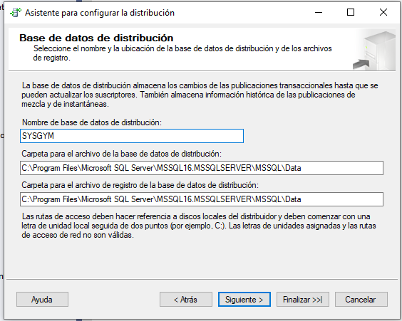

---

## 2. Instalación y configuración de Hamachi

### Se configuró la VPN para permitir comunicación entre las máquinas remotas.
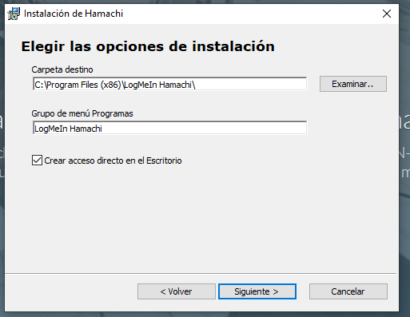

---
### Se verificó la conectividad correcta

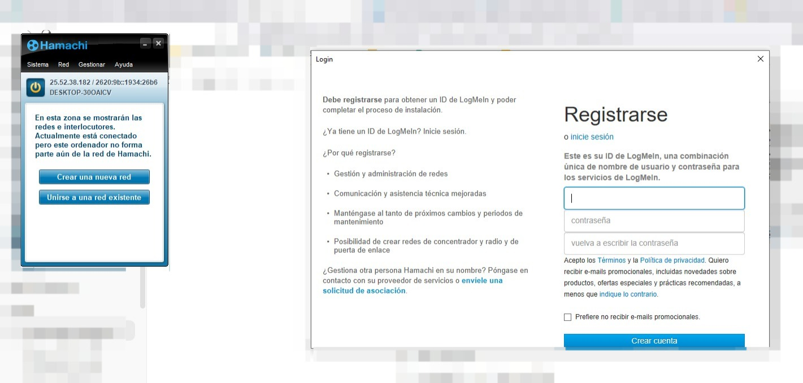

.
---

## 3. Creación de la publicación

### Desde SQL Server Developer se inicia el asistente.

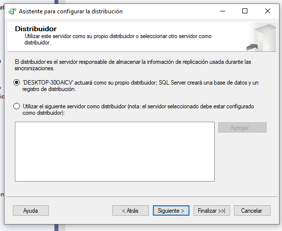

---
### Se continua con la selección de opciones iniciales.

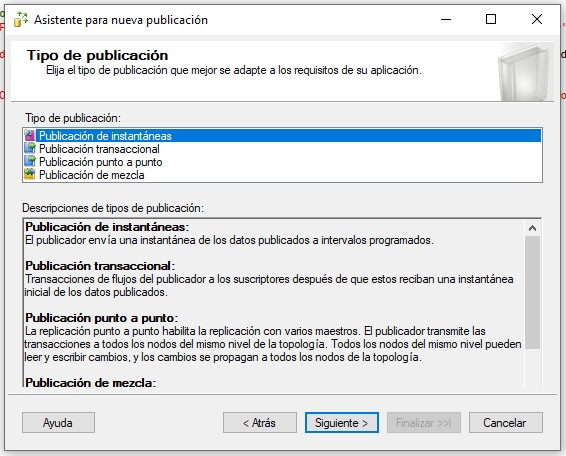

---

## 4. Selección de tablas
### Se eligen todas las tablas necesarias para los suscriptores.
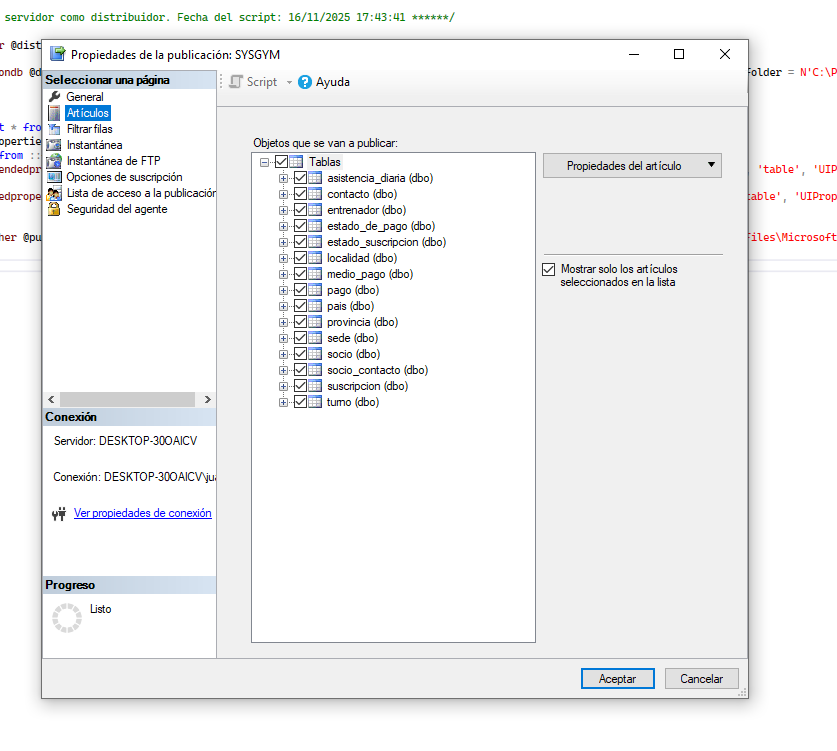

---

## 5. Finalización de la publicación
### Confirmación del asistente.
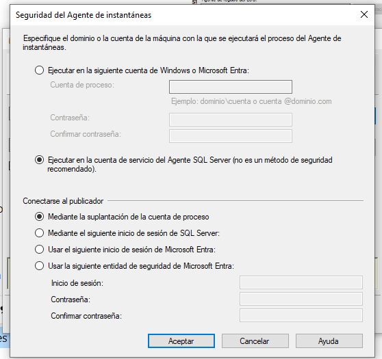

---

### Publicación creada correctamente.

---

## 6. Creación del suscriptor
### Se inicia el proceso para agregar un suscriptor.

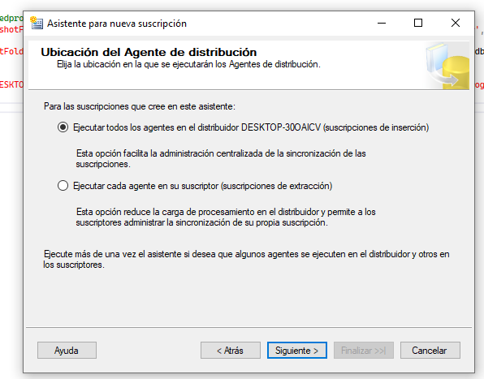

---

## 7. Configuración interna del suscriptor
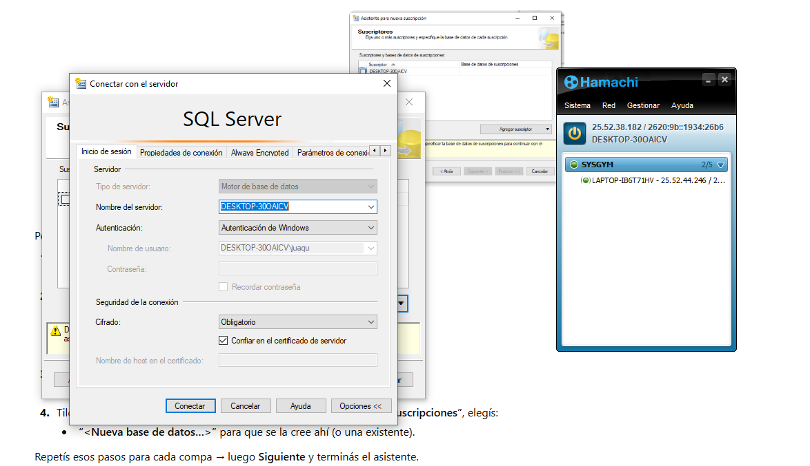

---
### 7.1 Se añade un suscriptor a partir de la IP de hamachiVPN y el puerto TCP = 1433

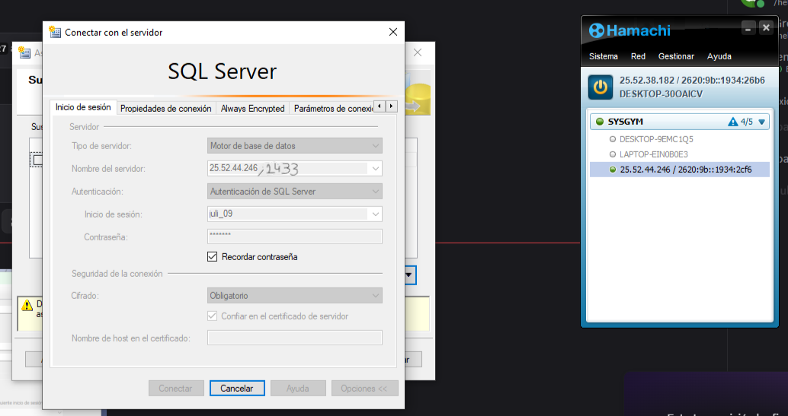

---

### 7.2 se elige que base de datos va a tener el suscriptor

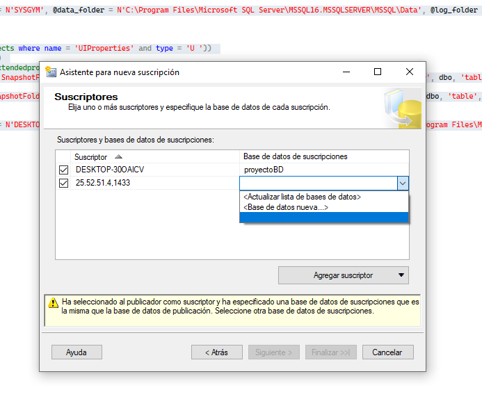

---

### 7.3 Se le crea una base de datos

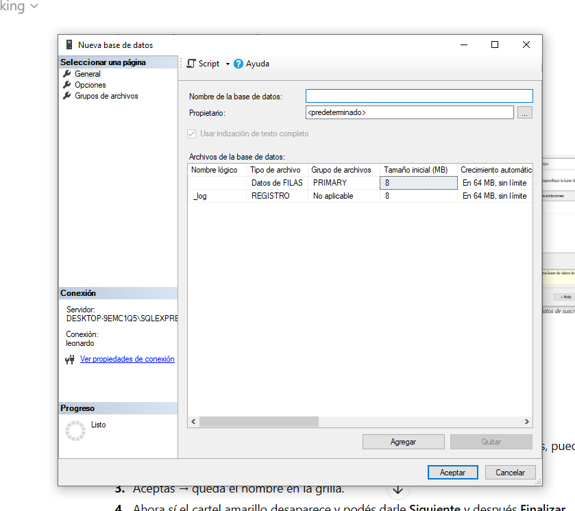

---

### 7.4 Se selecciona el agente del distribuidor que sera inicion de sesion de SQL server 

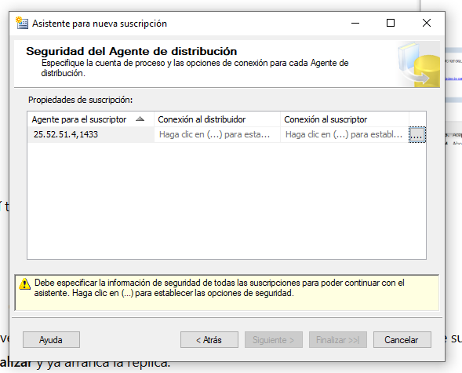

---
### 7.5 añadir datos del suscriptor y poner Ejecutar en la cuenta de servicio de Agent SQL server 

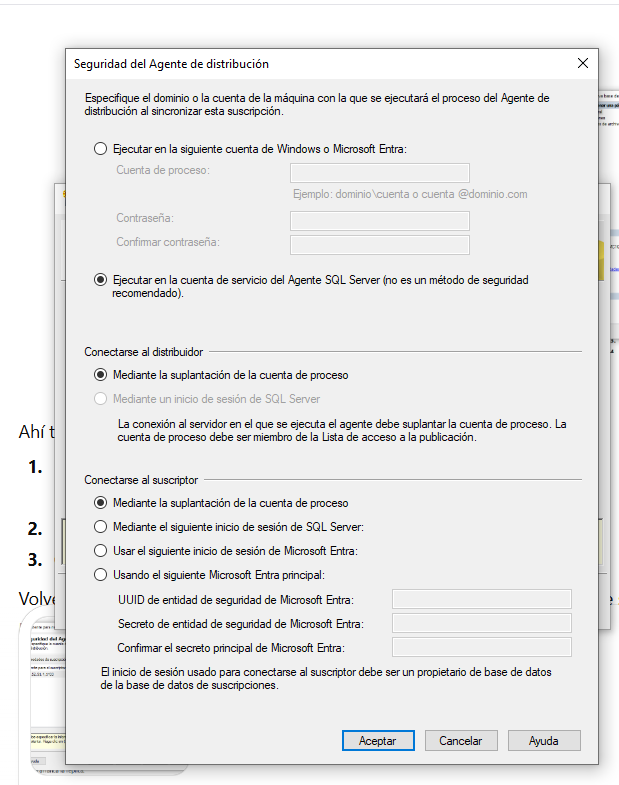

---

### 7.6 Se inicializa la suscripcion 

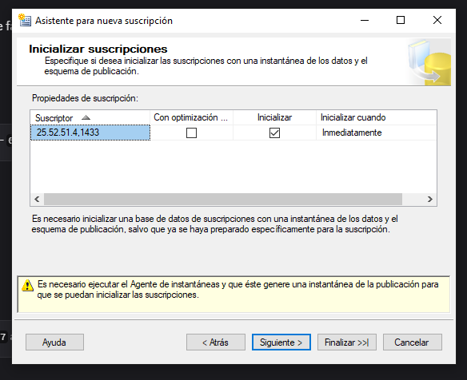

 

---

### 7.8 Configuración detallada del suscriptor.

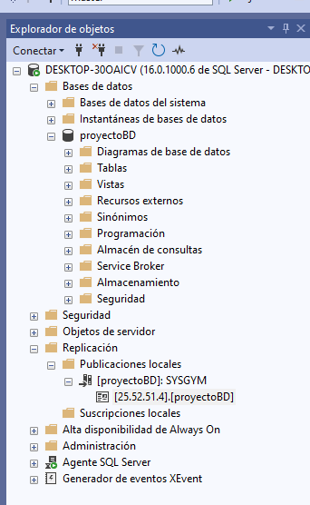

---
### 8 Estado de Agente con snapshot

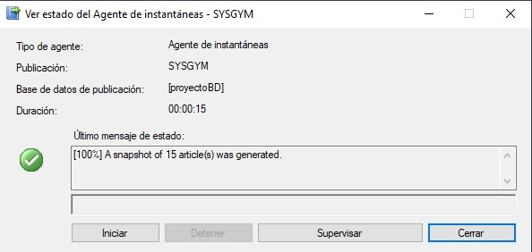

---
## Fin del proceso
El sistema de replicación queda habilitado entre maestro  (publicador) y esclavos (suscriptores) vía VPN Hamachi.
